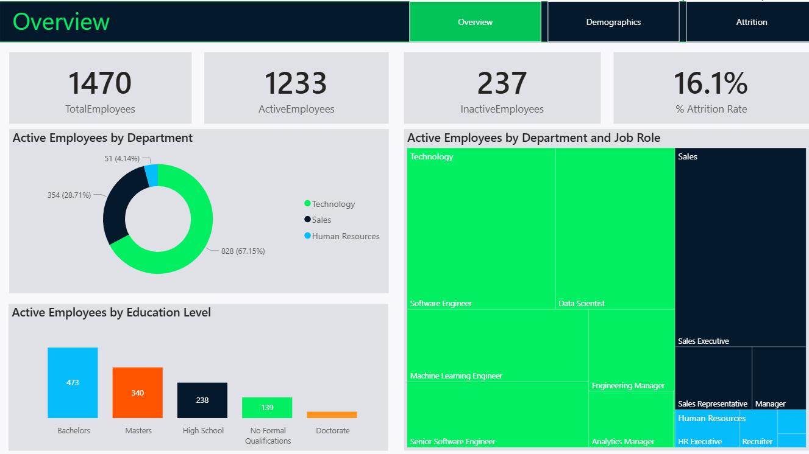
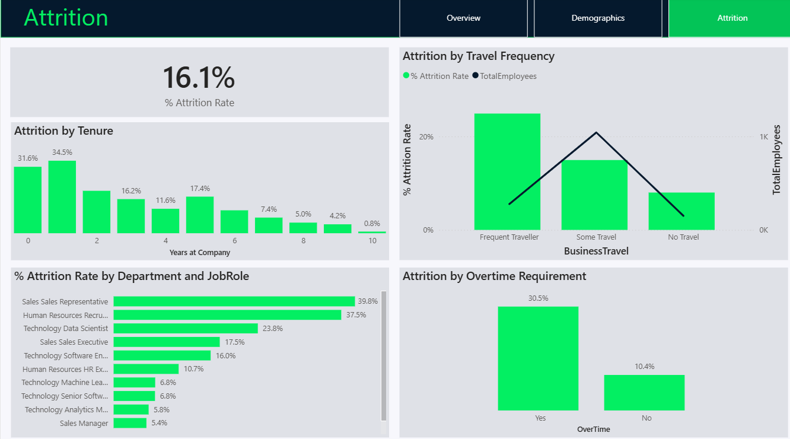

# Employee Attrition Analysis with Power BI
This Power BI case study explores HR data for a fictitious software company, focusing on employee attrition. The project involves importing, transforming, and modeling data, followed by insightful visualizations using DAX. The final report provides key insights on factors contributing to attrition, all presented in a clean, branded layout.

---

## 📂 Dataset Overview
### **Employee Dataset (`employee.csv`)**

This dataset contains detailed employee information, including demographics, job roles, compensation, work history, and attrition status. It serves as the primary data source for analyzing workforce trends, employee retention, and organizational structure.

---

| **Field Name**               | **Description**                                                                |
|-----------------------------|---------------------------------------------------------------------------------|
| `EmployeeID`                | Unique identifier assigned to each employee                                     |
| `FirstName` / `LastName`    | Employee’s first and last names                                                |
| `Gender`                    | Gender identity of the employee (e.g., Male, Female)                           |
| `Age`                       | Employee's age in years                                                        |
| `BusinessTravel`            | Frequency of business travel (e.g., Rarely, Frequently, Non-Travel)            |
| `Department`                | Department where the employee works (e.g., Sales, R&D, HR)                     |
| `DistanceFromHome (KM)`     | Distance from the employee’s home to the office in kilometers                  |
| `State`                     | State or region of employment                                                  |
| `Ethnicity`                 | Ethnic background of the employee                                              |
| `Education`                 | Highest level of education attained (numeric scale: 1–5)                        |
| `EducationField`            | Field of study (e.g., Life Sciences, Technical Degree, Business)               |
| `JobRole`                   | Specific job title or role within the company                                  |
| `MaritalStatus`             | Marital status (e.g., Single, Married, Divorced)                               |
| `Salary`                    | Annual salary of the employee                                                  |
| `StockOptionLevel`          | Number of stock options awarded (0–3 scale)                                    |
| `OverTime`                  | Indicates if the employee regularly works overtime (Yes/No)                    |
| `HireDate`                  | Date the employee joined the company                                           |
| `Attrition`                 | Indicates if the employee has left the company (Yes/No)                        |
| `YearsAtCompany`            | Total number of years the employee has been with the company                   |
| `YearsInMostRecentRole`     | Years the employee has spent in their current or most recent role              |
| `YearsSinceLastPromotion`   | Time since the employee's last promotion                                       |
| `YearsWithCurrManager`      | Number of years under the current manager                                      |

---

###  **Education Levels Dataset (`education_levels.csv`)**

This supporting dataset provides a mapping between education level IDs and their corresponding descriptive labels (e.g., Bachelor's, Master's). It helps enrich the analysis by translating numeric codes into meaningful education categories for clearer visualizations and insights.

| **Field Name**         | **Description**                                                   |
|------------------------|-------------------------------------------------------------------|
| `EducationLevelID`     | Numeric code representing the education level (1 to 5)            |
| `EducationLevel`       | Descriptive label for education level (e.g., Below College, etc.) |

### Education Level Values

| `EducationLevelID` | `EducationLevel`     |
|--------------------|----------------------|
| 1                  | No Formal Qualifications        |
| 2                  | High Shcool              |
| 3                  | Bachelors    |
| 4                  | Master     |
| 5                  | Doctorate            |

## Project Steps

### 1. Data Preparation

- Imported HR dataset into Power BI
- Performed data cleaning and validation
- Created relationships between fact and dimension tables
- Created calculated columns and dax measures

### 2. Data Analysis & Exploration

- Built DAX measures for KPIs like attrition rate, active/inactive headcount, average salary
- Segmented data by departments, demographics, job satisfaction, and tenure
- Conducted exploratory analysis on attrition trends and drivers

### 3. Data Visualization with Power BI

  - Designed a multi-page interactive report:
  - Overview Page: Company-wide KPIs & department insights
  - Demographics Page: Attrition by age, gender, marital status, ethnicity & average salary 
  - Attrition Deep Dive: Explored what factors contribute to the attrition 
---

## Key Insights

- Employees who travel frequently for business show a higher rate of attrition.
- The majority of attrition occurs within the first 0–2 years of employment.
- Roles such as Sales Representatives in the Sales department and HR Recruiters, which fall within the lowest salary bands, experience higher turnover rates.
- Employees required to work overtime are significantly more likely to leave the company.

---
## Conclusion

This Power BI report provides clear insights into the key drivers of employee attrition. Factors such as frequent business travel, lower salary bands, overtime, and short tenure are closely linked to higher turnover. These findings enable HR teams to take proactive steps toward improving retention through data-driven decisions. The interactive dashboards offer a clear and accessible way to monitor trends and support strategic planning.

